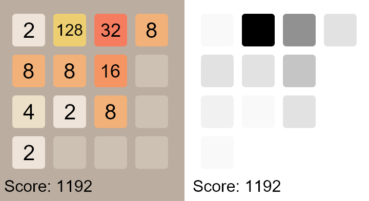

# 2048-reactive

Reactive & Responsive 2048 game made with the MVVM paradigm using Google's [ReactiveX](https://reactivex.io) framework.
The left view is the normal game view, and the right one is a normalized view. 
Both views subscribe to the same view model, while the view model observes the game model.

This project was used to practice the following skills:
* Responsive programming using ReactiveX
* Better abstractions for less coupling
* Applying design patterns such as:
  * Dependency Injection [See Provider.java](src/main/java/dependency/Provider.java)
  * MVVM
  * Observer
  * Singleton [See Provider.java](src/main/java/dependency/Provider.java)
* Using states for GUI interaction 

# Thanks To
* [bulenkov](https://github.com/bulenkov) for his 2048 tile color and sizing
* https://codereview.stackexchange.com/a/120644 for matrix clockwise rotation.
